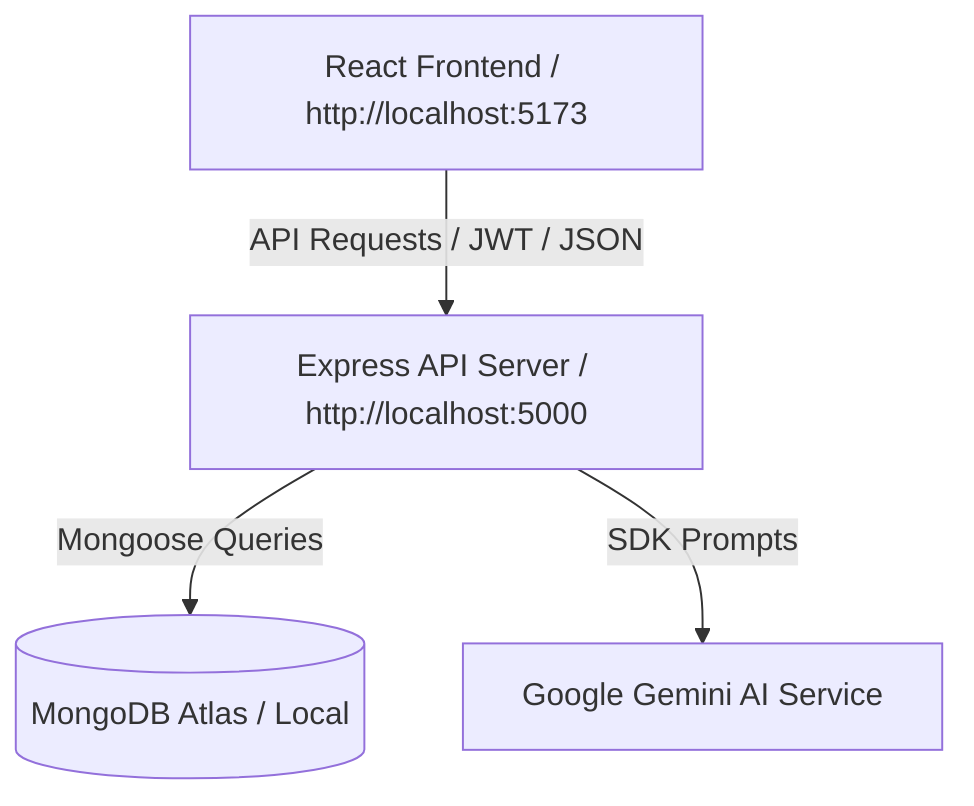

# THRYVE System Architecture

THRYVE is designed as a modular full-stack application structured into a unified monorepo to ensure seamless coordination between client and server components.

---

## 1. Frontend Architecture
The client is a single-page application built on React, Vite, and custom CSS variables integrated with Tailwind CSS.

### Key Directories
- `src/layouts/`: Provides container frameworks, notably `DashboardLayout.jsx` which injects a responsive navigation layout with sidebar transitions.
- `src/pages/`: Modular page views including `Dashboard.jsx`, `MoodTracker.jsx`, `JournalPage.jsx`, and `AIChat.jsx`.
- `src/components/`: Reusable UI modules like `Card.jsx`, `Button.jsx`, and custom vector graphics inside `Illustrations.jsx`.
- `src/context/`: Core states such as `AuthContext.jsx` supplying global session data down the widget tree.
- `src/services/`: Client-side REST dispatch functions utilizing `axios` (e.g. `moodService.js`, `journalService.js`).

### Design & Styling
Styling relies on global tokens defined in `src/index.css`:
- **Palette**: A curated warm cream/terracotta palette (`#FFF9F5`, `#F5ECE5`, `#D98C6B`, `#F7D8C5`, `#B8C9A3`, `#5A4A42`, `#E7D8CC`).
- **Layout Rhythm**: Elements are structured on an 8px grid system to guarantee consistent padding, margins, and card alignment.
- **Animations**: Soft ease transitions, custom tooltip fade-ins, and floating background pastel blobs.

---

## 2. Backend Architecture
The backend is a Node.js REST API service built on Express.js utilizing a clean controller-service-repository pattern.

### Key Component Layers
1. **Routing Layer (`src/routes/`)**: Maps network routes directly to controllers.
2. **Controller Layer (`src/controllers/`)**: Manages parameter parsing, sanitizes client payload input, and formats response envelopes.
3. **Service Layer (`src/services/`)**: Enforces validation logic, connects to external Gemini AI helper libraries, and runs calculations.
4. **Data Repository Layer (`src/models/`)**: Mongoose schemas defining attributes, indexes, and validation rules for collections (Users, MoodLogs, JournalEntries, Habits, CommunityPosts, Resources).

### AI Integration
The AI chat companion utilizes Google's Gemini SDK (`@google/generative-ai`) to offer cognitive support. The conversation history is managed on a context buffer and processed with system instructions to ensure empathetic response formats.
